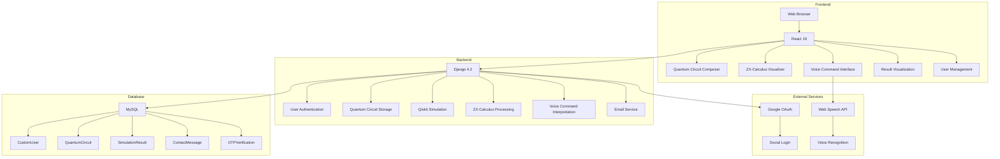
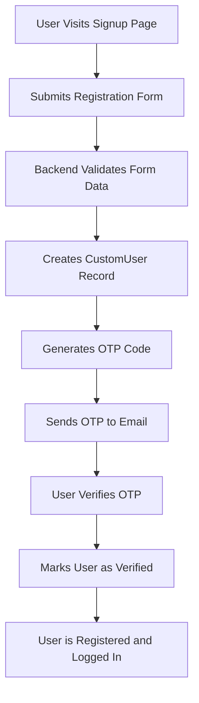
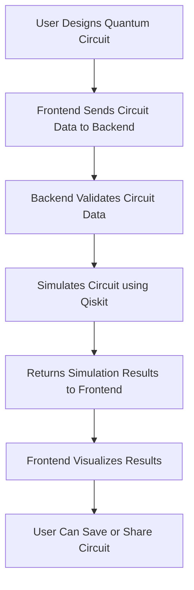
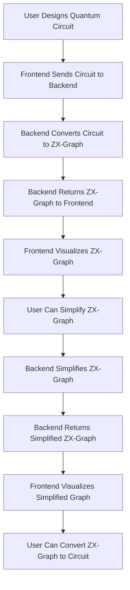
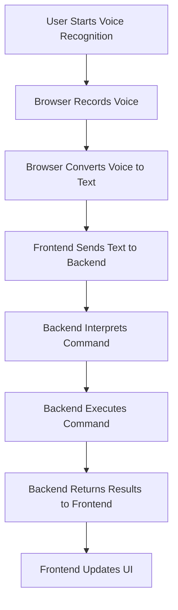

# QuantumSim - System Architecture

## Overview

This document provides a comprehensive architectural overview of QuantumSim, a cloud-based quantum computing simulator. The architecture is designed to be scalable, modular, and user-friendly, providing an interactive platform for quantum circuit design, simulation, and visualization.

## System Architecture Diagram

## Architecture Components

### Frontend Layer

The frontend layer is responsible for providing an intuitive user interface for QuantumSim. It is built using modern web technologies and follows a component-based architecture.

#### Technologies

- **React 19**: Modern UI library for building user interfaces
- **Tailwind CSS 4**: Utility-first CSS framework for rapid development
- **Vite**: Fast build tool for modern web applications
- **React Router**: Client-side routing
- **Axios**: HTTP client for API requests
- **Lucide React**: Open-source icon library
- **Web Speech API**: Browser-based speech recognition

#### Key Components

1. **Quantum Circuit Composer**: Visual interface for designing quantum circuits
2. **ZX-Calculus Visualizer**: Graph-based representation of quantum circuits
3. **Voice Command Interface**: Natural language interface for circuit design
4. **Result Visualization**: Real-time visualization of quantum state and simulation results
5. **User Management**: Account creation, login, and profile management
6. **Contact Form**: Feedback and support functionality

### Backend Layer

The backend layer handles all server-side operations, including user authentication, quantum circuit storage, simulation, and ZX-calculus processing.

#### Technologies

- **Django 4.2**: Python web framework
- **Django REST Framework**: Toolkit for building REST APIs
- **MySQL 8.0**: Relational database management system
- **JWT**: JSON Web Tokens for authentication
- **Qiskit**: Quantum computing library for circuit simulation
- **zx-calculus**: Library for ZX-graph representation and simplification
- **Django CORS Headers**: Cross-origin resource sharing

#### Key Services

1. **User Authentication**: Secure user registration and login
2. **Quantum Circuit Storage**: Persistent storage for quantum circuits
3. **Qiskit Simulation**: Quantum circuit simulation using Qiskit
4. **ZX-Calculus Processing**: Circuit to ZX-graph conversion and simplification
5. **Voice Command Interpretation**: Natural language processing for voice commands
6. **Email Service**: OTP verification and password reset emails

### Database Layer

The database layer stores all persistent data for the QuantumSim system.

#### Tables

1. **CustomUser**: User account information
2. **OTPVerification**: OTP codes for email verification
3. **QuantumCircuit**: Quantum circuit data
4. **SimulationResult**: Simulation results of quantum circuits
5. **ContactMessage**: Contact form submissions

### External Services

QuantumSim integrates with external services to enhance its functionality.

#### Google OAuth

- Provides social login functionality using Google accounts
- Streamlines user registration and login process
- Improves security by leveraging Google's authentication system

#### Web Speech API

- Browser-based speech recognition service
- Enables voice command functionality
- Supports multiple languages and accents

## Data Flow

### User Registration and Authentication

### Quantum Circuit Design and Simulation

### ZX-Calculus Visualization

### Voice Command Processing

## API Architecture

### Authentication Endpoints

| Endpoint | Method | Description |
|----------|--------|-------------|
| `/api/register/` | POST | User registration |
| `/api/login/` | POST | User login |
| `/api/logout/` | POST | User logout |
| `/api/verify-otp/` | POST | OTP verification |
| `/api/resend-otp/` | POST | Resend OTP |
| `/api/forgot-password/` | POST | Forgot password |
| `/api/reset-password/` | POST | Reset password |

### Quantum Circuit Endpoints

| Endpoint | Method | Description |
|----------|--------|-------------|
| `/api/circuits/` | GET | Get user's circuits |
| `/api/circuits/` | POST | Create new circuit |
| `/api/circuits/<int:circuit_id>/` | GET | Get specific circuit |
| `/api/circuits/<int:circuit_id>/` | PUT | Update circuit |
| `/api/circuits/<int:circuit_id>/` | DELETE | Delete circuit |
| `/api/simulate/` | POST | Simulate circuit |

### ZX-Calculus Endpoints

| Endpoint | Method | Description |
|----------|--------|-------------|
| `/api/circuit-to-zx/` | POST | Convert circuit to ZX-graph |
| `/api/zx-simplify/` | POST | Simplify ZX-graph |
| `/api/zx-to-circuit/` | POST | Convert ZX-graph to circuit |

### Voice Command Endpoints

| Endpoint | Method | Description |
|----------|--------|-------------|
| `/api/voice-command/` | POST | Process voice command |
| `/api/text-to-circuit/` | POST | Process text command to circuit |

### Code Generation Endpoints

| Endpoint | Method | Description |
|----------|--------|-------------|
| `/api/generate-python/` | POST | Generate Python code from circuit |
| `/api/generate-qasm/` | POST | Generate QASM code from circuit |

### Statistics Endpoint

| Endpoint | Method | Description |
|----------|--------|-------------|
| `/api/statistics/` | GET | Get platform statistics |

### Contact Endpoints

| Endpoint | Method | Description |
|----------|--------|-------------|
| `/api/contact/` | POST | Submit contact message |
| `/api/contact/messages/` | GET | Get all contact messages (admin only) |
| `/api/contact/messages/<int:message_id>/` | GET | Get specific contact message (admin only) |

## Security Architecture

### User Authentication

- **JWT Tokens**: JSON Web Tokens for secure authentication
- **Password Hashing**: Django's PBKDF2 with SHA-256 for password storage
- **OTP Verification**: One-time passwords for email verification
- **Google OAuth**: Secure social login option

### Data Security

- **HTTPS**: All API requests and responses are encrypted
- **Input Validation**: Strict validation of user input to prevent attacks
- **SQL Injection Prevention**: Django ORM for safe database interactions
- **CORS Headers**: Cross-origin resource sharing configuration

### Circuit Privacy

- **User Ownership**: Each circuit is associated with a specific user
- **Public/Private Options**: Users can choose to make circuits public or private
- **Sharing Control**: Users can share circuits with specific individuals

## Performance and Scalability

### Cloud-Based Architecture

- **Scalable Infrastructure**: Cloud hosting for high availability
- **Load Balancing**: Distribution of traffic across multiple servers
- **Caching**: Redis cache for frequently accessed data
- **CDN**: Content delivery network for static files

### Performance Optimization

- **Asynchronous Processing**: Background tasks for simulation and email sending
- **Caching**: Local and distributed caching for better performance
- **Query Optimization**: Efficient database queries using indexes
- **Response Compression**: Gzip compression for API responses

### Scalability Options

- **Vertical Scaling**: Increasing server resources (CPU, memory, storage)
- **Horizontal Scaling**: Adding more servers to handle traffic
- **Load Balancing**: Distributing traffic across multiple servers
- **Database Sharding**: Partitioning large datasets across multiple databases

## Future Enhancements

### Quantum Computing Features

- **Advanced Quantum Gates**: Support for more quantum gates and operations
- **Quantum Error Correction**: Simulation of error-correcting codes
- **Quantum Hardware Integration**: Integration with real quantum hardware
- **Quantum Circuit Optimization**: Advanced circuit optimization algorithms

### Platform Features

- **Collaboration**: Real-time collaboration on quantum circuits
- **Version Control**: Circuit version history and rollback
- **Community Features**: User profiles, ratings, and reviews
- **Tutorials and Documentation**: Interactive tutorials and documentation

### Technical Improvements

- **Performance Optimization**: Further optimization of simulation speed
- **Scalability**: Improved scaling for large numbers of users
- **Security**: Enhanced security features and compliance
- **Accessibility**: Improved accessibility for users with disabilities

## Conclusion

QuantumSim's architecture is designed to be scalable, modular, and user-friendly. The system uses modern technologies to provide an intuitive platform for quantum circuit design, simulation, and visualization. The architecture supports a wide range of quantum computing features and is designed to scale to meet the needs of future users.
