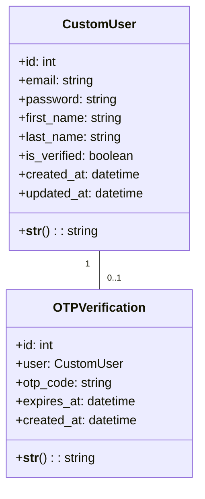
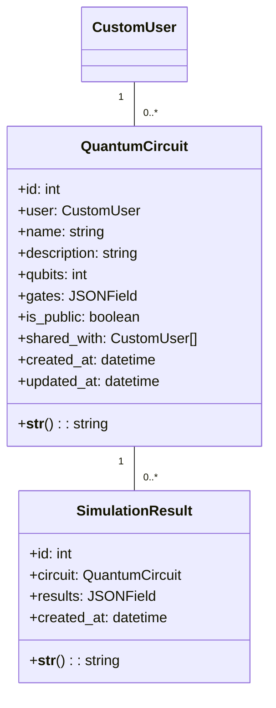
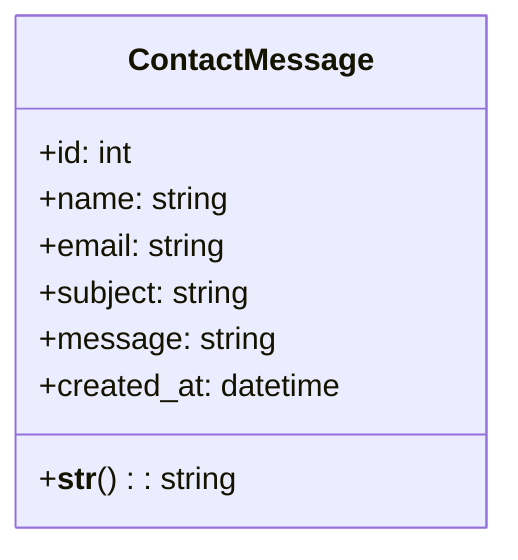
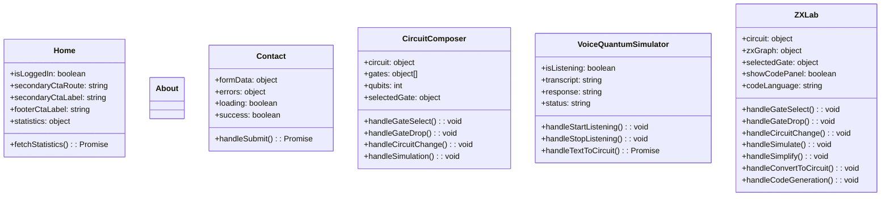
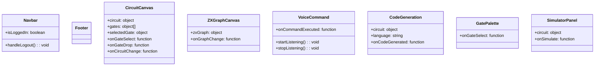

# Class Diagram for QuantumSim

## Overview

This document provides a detailed class diagram of the QuantumSim system, including both frontend and backend components.

## Backend Classes

### User Management Classes

### Quantum Circuit Classes

### Contact Message Classes

## Frontend Components

### Main Pages

### Components

## API Views

```mermaid
classDiagram
    class HealthCheckView {
        +get(): Response
    }
    
    class StatisticsView {
        +get(): Response
    }
    
    class UserRegistrationView {
        +post(): Response
    }
    
    class UserLoginView {
        +post(): Response
    }
    
    class UserLogoutView {
        +post(): Response
    }
    
    class OTPVerificationView {
        +post(): Response
    }
    
    class ResendOTPView {
        +post(): Response
    }
    
    class UserProfileView {
        +get(): Response
        +put(): Response
    }
    
    class ForgotPasswordView {
        +post(): Response
    }
    
    class ResetPasswordView {
        +post(): Response
    }
    
    class QuantumCircuitView {
        +get(): Response
        +post(): Response
    }
    
    class QuantumCircuitDetailView {
        +get(): Response
        +put(): Response
        +delete(): Response
    }
    
    class QuantumCircuitSimulationView {
        +post(): Response
    }
    
    class QuantumCircuitSimulationResultsView {
        +get(): Response
    }
    
    class QuantumCircuitShareView {
        +post(): Response
    }
    
    class QuantumCircuitPublicView {
        +post(): Response
    }
    
    class PublicQuantumCircuitsView {
        +get(): Response
    }
    
    class ContactMessageView {
        +post(): Response
    }
    
    class ContactMessagesListView {
        +get(): Response
    }
    
    class ContactMessageDetailView {
        +get(): Response
    }
    
    class VoiceCommandView {
        +post(): Response
    }
    
    class TextToCircuitView {
        +post(): Response
    }
    
    class PythonCodeGenerationView {
        +post(): Response
    }
    
    class QASMGenerationView {
        +post(): Response
    }
    
    class CircuitToZXGraphView {
        +post(): Response
    }
    
    class ZXGraphSimplificationView {
        +post(): Response
    }
    
    class ZXGraphToCircuitView {
        +post(): Response
    }
```

## API Serializers

```mermaid
classDiagram
    class UserRegistrationSerializer {
    }
    
    class UserLoginSerializer {
    }
    
    class UserSerializer {
    }
    
    class OTPVerificationSerializer {
    }
    
    class ForgotPasswordSerializer {
    }
    
    class ResetPasswordSerializer {
    }
    
    class QuantumCircuitSerializer {
    }
    
    class SimulationResultSerializer {
    }
    
    class ContactMessageSerializer {
    }
```

