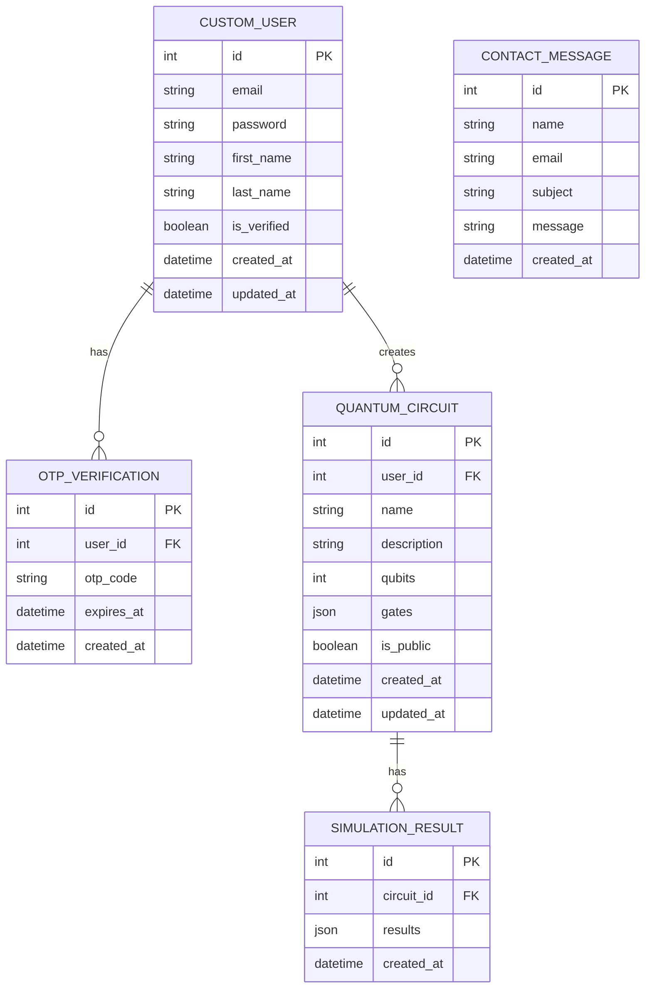

# ER Diagram for QuantumSim

## Overview

This document provides an Entity-Relationship (ER) diagram for the QuantumSim system. The diagram shows the relationships between the database tables and the attributes of each table.

## ER Diagram

## Table Descriptions

### CustomUser

Stores user account information.

- **id**: Primary key (auto-incrementing integer)
- **email**: User's email address (unique)
- **password**: Hashed user password
- **first_name**: User's first name (optional)
- **last_name**: User's last name (optional)
- **is_verified**: Whether the user has verified their email (default: False)
- **created_at**: Date and time when the user was created
- **updated_at**: Date and time when the user was last updated

### OTPVerification

Stores OTP (One-Time Password) information for email verification.

- **id**: Primary key (auto-incrementing integer)
- **user_id**: Foreign key to CustomUser (required)
- **otp_code**: 6-digit OTP code
- **expires_at**: Date and time when the OTP expires (default: 10 minutes after creation)
- **created_at**: Date and time when the OTP was created

### QuantumCircuit

Stores quantum circuit information.

- **id**: Primary key (auto-incrementing integer)
- **user_id**: Foreign key to CustomUser (required)
- **name**: Circuit name (required)
- **description**: Circuit description (optional)
- **qubits**: Number of qubits in the circuit (default: 5)
- **gates**: JSON field storing circuit gates information
- **is_public**: Whether the circuit is accessible to everyone (default: False)
- **created_at**: Date and time when the circuit was created
- **updated_at**: Date and time when the circuit was last updated

### SimulationResult

Stores simulation results of quantum circuits.

- **id**: Primary key (auto-incrementing integer)
- **circuit_id**: Foreign key to QuantumCircuit (required)
- **results**: JSON field storing simulation results
- **created_at**: Date and time when the simulation was performed

### ContactMessage

Stores contact form messages.

- **id**: Primary key (auto-incrementing integer)
- **name**: Sender's name (required)
- **email**: Sender's email address (required)
- **subject**: Message subject (required)
- **message**: Message content (required)
- **created_at**: Date and time when the message was sent

## Relationships

- **CustomUser → OTPVerification**: One-to-one relationship. Each user has one OTP verification record.
- **CustomUser → QuantumCircuit**: One-to-many relationship. Each user can create multiple quantum circuits.
- **QuantumCircuit → SimulationResult**: One-to-many relationship. Each circuit can have multiple simulation results.
- **QuantumCircuit → CustomUser (shared_with)**: Many-to-many relationship. Each circuit can be shared with multiple users (not explicitly shown in ER diagram).

## Database Configuration

The QuantumSim system uses MySQL 8.0+ as its database. The tables are automatically created using Django's ORM and migrations.

## Indexing

The following fields should be indexed for performance optimization:

- **CustomUser.email**: Unique index for fast user lookup
- **QuantumCircuit.user_id**: Foreign key index for fast circuit retrieval per user
- **OTPVerification.user_id**: Foreign key index for fast OTP retrieval per user
- **SimulationResult.circuit_id**: Foreign key index for fast simulation result retrieval per circuit

## Constraints

- **CustomUser.email**: Must be unique and valid email format
- **QuantumCircuit.qubits**: Must be a positive integer (minimum: 1, maximum: 10)
- **OTPVerification.otp_code**: Must be exactly 6 digits
- **ContactMessage**: All fields are required except for id and created_at

## Security Considerations

- **CustomUser.password**: Stored as a hashed value using Django's default password hashing algorithm (PBKDF2 with SHA-256)
- **OTPVerification.expires_at**: Ensures OTP codes are only valid for a limited time
- **QuantumCircuit.is_public**: Controls visibility of circuits to other users
