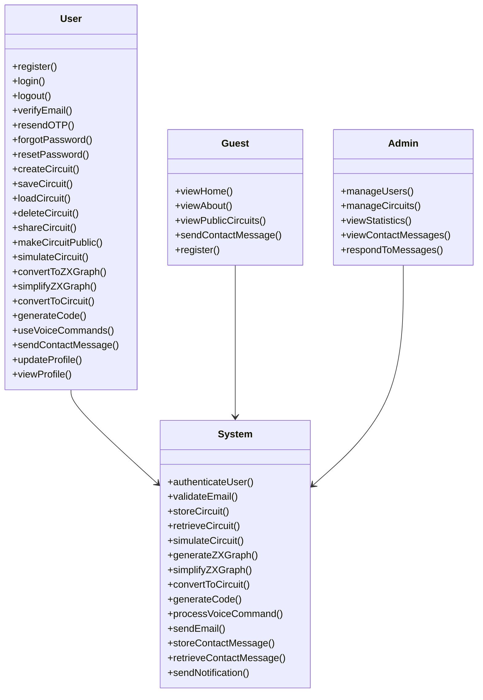
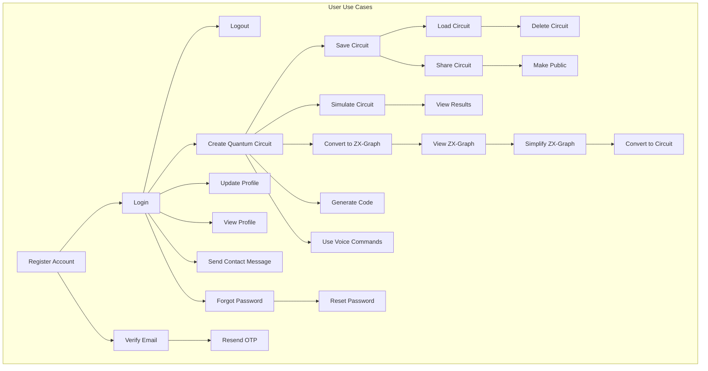
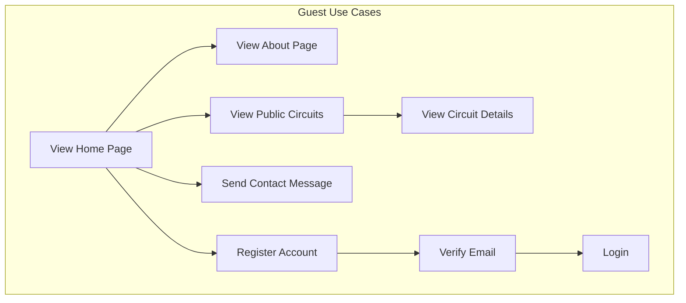
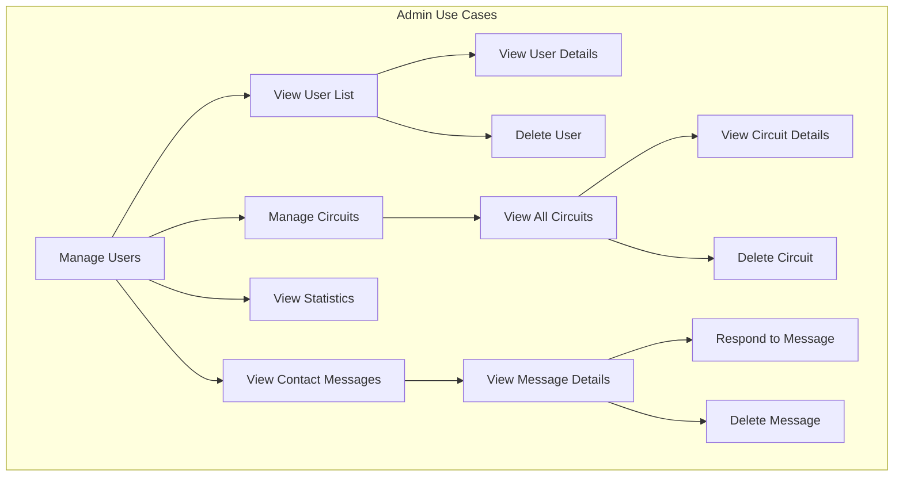
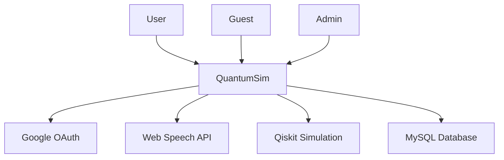

# QuantumSim - Use Case Diagram

## Overview

This document provides a comprehensive use case diagram for QuantumSim, a cloud-based quantum computing simulator. The diagram identifies all system actors and their interactions with the system.

## System Actors

### Primary Actors

1. **User**: A registered user of QuantumSim
2. **Guest**: A non-registered user of QuantumSim
3. **Admin**: System administrator with full access

## Use Case Diagram

## Use Case Diagrams by Actor

### User Use Cases

### Guest Use Cases

### Admin Use Cases

## Use Case Descriptions

### User Use Cases

#### Register Account
- **Actor**: User
- **Description**: Creates a new user account with email and password
- **Preconditions**: User is not logged in
- **Postconditions**: User account is created, and verification email is sent
- **Steps**:
  1. User navigates to registration page
  2. User fills out registration form
  3. System validates form data
  4. System creates user account
  5. System sends verification email with OTP
  6. User is directed to verification page

#### Login
- **Actor**: User
- **Description**: Logs into existing account
- **Preconditions**: User is not logged in
- **Postconditions**: User is logged in
- **Steps**:
  1. User navigates to login page
  2. User enters credentials or uses Google OAuth
  3. System validates credentials
  4. System creates authentication token
  5. User is logged in and redirected to home page

#### Create Quantum Circuit
- **Actor**: User
- **Description**: Creates a new quantum circuit
- **Preconditions**: User is logged in
- **Postconditions**: New quantum circuit is created
- **Steps**:
  1. User navigates to circuit composer
  2. User configures circuit properties
  3. User adds quantum gates
  4. User saves circuit
  5. System stores circuit in database

#### Simulate Circuit
- **Actor**: User
- **Description**: Runs quantum circuit simulation
- **Preconditions**: User is logged in and has created a circuit
- **Postconditions**: Simulation results are generated
- **Steps**:
  1. User navigates to circuit composer
  2. User clicks "Simulate" button
  3. System sends circuit to backend for simulation
  4. System runs simulation using Qiskit
  5. System returns results to frontend
  6. Frontend visualizes results

#### Convert to ZX-Graph
- **Actor**: User
- **Description**: Converts quantum circuit to ZX-graph
- **Preconditions**: User is logged in and has created a circuit
- **Postconditions**: ZX-graph representation is generated
- **Steps**:
  1. User navigates to ZX Lab
  2. User designs quantum circuit
  3. User clicks "Convert to ZX-Graph" button
  4. System sends circuit to backend
  5. System converts circuit to ZX-graph
  6. Frontend visualizes ZX-graph

#### Simplify ZX-Graph
- **Actor**: User
- **Description**: Simplifies ZX-graph representation
- **Preconditions**: User has converted circuit to ZX-graph
- **Postconditions**: Simplified ZX-graph is generated
- **Steps**:
  1. User views ZX-graph
  2. User clicks "Simplify" button
  3. System sends ZX-graph to backend
  4. System simplifies ZX-graph
  5. Frontend displays simplified graph

#### Use Voice Commands
- **Actor**: User
- **Description**: Uses voice commands to interact with system
- **Preconditions**: User is logged in
- **Postconditions**: Voice command is executed
- **Steps**:
  1. User navigates to voice simulator
  2. User clicks "Start Listening" button
  3. System starts recording voice
  4. User speaks command
  5. System converts voice to text
  6. System interprets command
  7. System executes command
  8. Frontend updates UI

#### Send Contact Message
- **Actor**: User
- **Description**: Sends contact message to support
- **Preconditions**: None (can be done by registered or guest users)
- **Postconditions**: Message is stored in database
- **Steps**:
  1. User navigates to contact page
  2. User fills out contact form
  3. System validates form data
  4. System stores message in database
  5. User receives confirmation

### Guest Use Cases

#### View Public Circuits
- **Actor**: Guest
- **Description**: Views public quantum circuits
- **Preconditions**: None
- **Postconditions**: Public circuits are displayed
- **Steps**:
  1. Guest navigates to public circuits page
  2. System retrieves public circuits from database
  3. Frontend displays public circuits
  4. Guest can view circuit details

#### Register Account (Guest Flow)
- **Actor**: Guest
- **Description**: Creates a new user account with email and password
- **Preconditions**: Guest is not logged in
- **Postconditions**: User account is created, and verification email is sent
- **Steps**:
  1. Guest navigates to registration page
  2. Guest fills out registration form
  3. System validates form data
  4. System creates user account
  5. System sends verification email with OTP
  6. Guest is directed to verification page

### Admin Use Cases

#### Manage Users
- **Actor**: Admin
- **Description**: Manages user accounts
- **Preconditions**: Admin is logged in
- **Postconditions**: User account is modified or deleted
- **Steps**:
  1. Admin navigates to user management page
  2. System retrieves all users
  3. Admin selects a user
  4. Admin views user details
  5. Admin can delete user
  6. System updates user record

#### View Statistics
- **Actor**: Admin
- **Description**: Views platform statistics
- **Preconditions**: Admin is logged in
- **Postconditions**: Statistics are displayed
- **Steps**:
  1. Admin navigates to statistics page
  2. System retrieves statistics from database
  3. Frontend displays statistics
  4. Admin can view detailed reports

#### View Contact Messages
- **Actor**: Admin
- **Description**: Views and responds to contact messages
- **Preconditions**: Admin is logged in
- **Postconditions**: Message is read and optionally responded to
- **Steps**:
  1. Admin navigates to contact messages page
  2. System retrieves unread messages
  3. Admin views message details
  4. Admin responds to message
  5. System stores response
  6. System sends notification to user

## Use Case Prioritization

### Must-Have Use Cases

- Register Account
- Login
- Logout
- Verify Email
- Create Quantum Circuit
- Save Circuit
- Load Circuit
- Simulate Circuit
- View Results
- Convert to ZX-Graph
- Simplify ZX-Graph
- Convert to Circuit
- Generate Code
- Send Contact Message

### Should-Have Use Cases

- Use Voice Commands
- Share Circuit
- Make Circuit Public
- View Public Circuits
- Forgot Password
- Reset Password
- Update Profile
- View Profile

### Could-Have Use Cases

- Manage Users
- Manage Circuits
- View Statistics
- Respond to Contact Messages
- Retry OTP Verification

## Non-Functional Requirements

### Performance
- **Response Time**: 90% of requests should complete in under 1 second
- **Uptime**: 99.9% service availability
- **Concurrent Users**: Support for 10,000+ concurrent users

### Security
- **Authentication**: JWT tokens with short expiration
- **Data Encryption**: HTTPS for all API requests
- **Password Storage**: PBKDF2 with SHA-256 hashing
- **Input Validation**: Strict validation of all user input

### Usability
- **Intuitive Interface**: Drag-and-drop circuit composer
- **Voice Command Recognition**: Accurate speech-to-text conversion
- **Responsive Design**: Works on mobile and desktop devices
- **Real-Time Visualization**: Interactive quantum state visualization

### Scalability
- **Horizontal Scaling**: Add servers to handle increased traffic
- **Database Sharding**: Partition large datasets across multiple databases
- **Caching**: Redis cache for frequently accessed data

## System Context Diagram

## Conclusion

The use case diagram provides a comprehensive overview of the QuantumSim system and its interactions with various actors. The system supports both registered users and guests, with a wide range of quantum computing and management features. The use case descriptions provide detailed information about each system functionality, helping to guide development and testing efforts.
